# multisite-sensorpack-mvp 設計資料

**課題：** 1人で複数拠点を遠隔監視できる後付けセンサーパック
**対象エディション：** MVP（需要調査）
**リポジトリ名：** `multisite-sensorpack-mvp`

> 本資料はMVPエディションのみを設計対象とする。他エディションの設計・比較は含まない。
> 製品定義上MVPは「監視：なし」であるが、これは**サービス自体の稼働監視・アラート通知（死活監視）を行わない**ことを指す。デバイス（ESP32）のオフライン検知は本課題の中核機能であるため、製品機能として実装する。

---

## 1. 仕様書

### 1.1 目的

倉庫・店舗・実家など複数の拠点に後付けできるセンサーパック（ESP32＋温湿度センサー＋LED＋ファン）を設置し、1人のユーザーがウェブダッシュボードから全拠点の環境状態を遠隔監視・簡易制御できるようにする。実需（継続利用）があるかを検証する。

### 1.2 プラットフォーム選定

- **ウェブ**を選定。複数拠点の遠隔集約には、任意の端末からのアクセスとインターネット経由のデータ収集が必須であり、ESP32通信方式がWi-Fi（テザリング可）であるウェブのみが要件を満たす。Bluetooth（デスクトップ・スマホ）は近距離限定のため不適。
- ハードウェア連携：**ESP32 + LED + ファン**（＋DHT22温湿度センサー）。Wi-Fi通信は外部API（従量課金API）には該当しない。

### 1.3 技術スタック（MVP制約準拠）

| 層 | 技術 |
|---|---|
| フロントエンド | Next.js（TypeScript）／デプロイ：無料Vercel |
| バックエンドAPI | Ruby on Rails（APIモード）／デプロイ：無料Railway（不可時のみRender） |
| AIサマリー | Python + FastAPI + LangChain（LangSmithで観測）／Railway |
| DB | PostgreSQL（本番）、**開発環境はSQLite** |
| 認証 | Googleログイン（OAuth 2.0 / OpenID Connect） |
| 管理画面 | Rails製・BASIC認証 |
| Bot対策 | reCAPTCHA（クレームコード発行フォーム・ログイン導線に適用） |
| デバイス | ESP32（Arduino）＋DHT22＋LED＋DCファン（リレー/MOSFET駆動） |

リアルタイム通信専用のGin APIは導入しない（30秒ポーリングで需要検証には十分であり、最小構成を優先）。

### 1.4 個人情報の取り扱い（MVP適用）

- Googleログインの**opaqueなユーザーID（sub値）のみ保持**し、メールアドレスは保存しない。
- 表示名はGoogleアカウントの表示名を画面表示にのみ使用（DBに保存しない）。
- 生年月日・氏名・住所・電話番号は一切収集しない。年齢層の収集も本課題では不要のため行わない。
- 拠点名はユーザーが自由入力するラベルであり、住所の入力を促すUI・バリデーションは設けない（プレースホルダは「倉庫A」等の例示とする）。
- 通知は**アプリ内通知のみ**（メール非保持のためメール通知は実装しない）。

### 1.5 機能一覧

| # | 機能 | 概要 |
|---|---|---|
| F1 | デバイス登録 | クレームコード方式でESP32をユーザー・拠点に紐付け |
| F2 | テレメトリ受信 | 温湿度データの受信・検証・保存 |
| F3 | 閾値判定 | ヒステリシス付き閾値評価とアラート生成 |
| F4 | オフライン検知 | デバイスの通信途絶を検知しアラート化 |
| F5 | 遠隔制御 | LED・ファンのON/OFF（手動＋自動ルール） |
| F6 | ダッシュボード | 複数拠点の状態一覧・時系列グラフ |
| F7 | AI日次サマリー | 過去24hの環境傾向とアラートの自然言語要約（1日1回） |
| F8 | アラート管理 | 一覧・確認（ack）・自動クローズ |
| F9 | 管理画面 | デバイス一覧・AIクォータ手動リセット（BASIC認証） |

### 1.6 関数ロジック（自然言語・最終版 v3）

#### F1 デバイス登録 `claim_device`

1. ユーザーがダッシュボードの「デバイス追加」でreCAPTCHAを通過し、拠点を指定してクレームコード発行を要求する。
2. サーバーは8桁英数字のクレームコードを生成し、有効期限15分・対象拠点・発行ユーザー（sub）とともに保存する。
3. ESP32は初回起動時にAPモードで立ち上がり、ユーザーがスマホ等からWi-Fi情報とクレームコードを入力する。
4. ESP32がサーバーへクレームコードを送信する。サーバーは未使用・期限内のコードと照合し、成立したらデバイスレコードを作成し、長寿命のデバイストークンを発行して返す。コードは使用済みにする。
5. 照合失敗が同一コードに対して累計5回に達したら、そのコードを即時失効させる（総当たり対策）。IP単位のレート制限も併用する。
6. 削除済みデバイスの再登録は、新しいクレームコードで新デバイスとして扱う（旧データは論理削除のまま保持）。

#### F2 テレメトリ受信 `ingest_telemetry`

1. ESP32は60秒間隔（デバイス設定で変更可）で、デバイストークン・連番seq・温度・湿度をPOSTする。
2. サーバーはトークンを検証し、無効・論理削除済みデバイスなら401/410で拒否する。
3. 記録時刻は**サーバー受信時刻を採用**する（端末時計のずれ・未来時刻を無害化）。端末申告時刻は参考値として保持のみ。
4. 値域チェック：温度 −40〜85℃、湿度 0〜100%。逸脱は不正データとして破棄し、破棄件数をデバイス統計に記録する。
5. `device_id + seq` の組で重複排除する（再送による二重計上防止）。
6. 保存後、デバイスの `last_seen` を更新し、F3（閾値判定）を同期実行する。
7. レスポンスに、当該デバイス宛の未配信コマンド（TTL内・`issued_at`昇順・最大5件）をピギーバックで同梱する（F5）。

#### F3 閾値判定 `evaluate_thresholds`

1. 対象メトリクス（温度・湿度）ごとに、上限・下限の発報閾値とデッドバンド（既定：温度1.0℃、湿度3%）を持つ。
2. 状態はメトリクス×方向ごとに NORMAL / BREACHED の2状態で管理する。
3. **発報条件：** NORMAL状態で「値が発報閾値を厳密に超過（上限は value > 閾値、下限は value < 閾値。境界値ちょうどは正常）」が**連続3回**成立したとき、BREACHEDに遷移しアラートをopenする。単発スパイクでは発報しない。
4. **解除条件：** BREACHED状態で「値が解除閾値（上限は 発報閾値−デッドバンド 以下、下限は 発報閾値＋デッドバンド 以上）」が**連続3回**成立したとき、NORMALに遷移しアラートを自動クローズする。
5. BREACHED中は同一メトリクス×方向のアラートを重複生成しない。
6. 閾値が未設定のメトリクスは判定をスキップする。

#### F4 オフライン検知 `detect_offline`

1. バックグラウンドジョブが1分周期で全アクティブデバイスを走査する。
2. 判定式：現在時刻 − `last_seen` ＞ 期待送信間隔 × 3 ＋ 猶予30秒 のときオフラインとみなす。
3. **判定直前に `last_seen` をトランザクション内で再読込**し、走査中に到着したテレメトリとの競合（誤発報）を排除する。
4. オフライン判定でデバイス状態をofflineにし、オフラインアラートをopenする（open中は重複生成しない）。
5. テレメトリ受信で状態がofflineだった場合はonlineへ復帰させ、オフラインアラートを自動クローズする。
6. 登録直後（テレメトリ未受信）のデバイスはprovisioning状態とし、オフライン判定の対象外とする。

#### F5 遠隔制御 `dispatch_command`

1. ユーザーがダッシュボードからLED ON/OFF・ファンON/OFFを指示すると、冪等ID付きコマンドをキューに積む（状態：pending、TTL 10分）。対象デバイスの所有者チェックを必ず行う。
2. コマンドはF2のレスポンスにピギーバックして配信する（状態：delivered）。専用ポーリングは設けない。
3. ESP32は実行後、次回テレメトリに実行結果ACK（冪等ID）を同梱する。サーバーはACKで完了（done）にする。**同一冪等IDの重複ACKは無視**する。
4. TTL超過で未配信・未ACKのコマンドはexpiredにし、UIに「届きませんでした」と表示する。
5. **自動ルール：** ユーザーが有効化した場合、温度上限アラートのopenでファンONコマンドを、クローズでファンOFFコマンドを自動発行する。LEDはアラートopen中の現地表示灯として自動制御する。
6. **競合解決：** 手動コマンド発行後30分間は、同一アクチュエータへの自動ルール発行を抑止する（手動優先・オーバーライドウィンドウ）。
7. オフライン中のデバイスへの発行は許可するが、UIで「オフラインのため復帰後TTL内のみ実行」と警告する。

#### F6 ダッシュボード集計 `render_dashboard`

1. すべてのクエリに認証ユーザーのIDを必須条件として付与し、他ユーザーのデータを構造的に参照不可能にする（テナント分離）。
2. 拠点一覧：拠点ごとにデバイス数・オンライン数・openアラート数・最新温湿度を表示する。
3. デバイス詳細：直近24h/7dの時系列グラフ、閾値ライン、コマンド履歴、アラート履歴を表示する。
4. 画面は30秒間隔のポーリングで更新する。
5. 時系列は7日を超えた生データを日次で1時間粒度に集約し、生データは14日で削除する（無料枠のストレージ節約）。

#### F7 AI日次サマリー `generate_daily_summary`

1. クォータ判定：**クォータ日＝JSTの現在時刻から3時間引いた日付**とし、同一クォータ日に既に生成済みなら429で拒否する（JST03:00リセットと等価）。
2. 過去24hのテレメトリ統計（最小・最大・平均・閾値超過時間）とアラート履歴を集計し、**統計値のみ**（個人情報なし）をLangChain経由でLLMに渡して日本語サマリーを生成する。
3. 生成結果はユーザーに紐付けて保存し、当日中は保存済みサマリーを再表示する。
4. データが存在しない場合はLLMを呼ばず「データ不足」の定型文を返す（クォータを消費しない）。
5. 管理画面から開発者が任意ユーザーのクォータを手動リセットできる。

#### F8 アラート管理 `manage_alerts`

1. アラートは open → acknowledged →（解除条件成立で）closed、または open →（解除条件成立で）closed と遷移する。
2. ユーザーはopen/acknowledgedのアラートを一覧で確認し、ackできる。closeは閾値・オフラインの解除条件成立による自動のみとする。
3. 通知はアプリ内通知バッジのみ（メール非保持のため）。

### 1.7 マスタデータ件数（MVPエディション）

| マスタ | 件数 | 内容 |
|---|---|---|
| センサー種別マスタ | **2件** | 温度、湿度 |
| アクチュエータ種別マスタ | **2件** | LED、ファン |
| コマンド種別マスタ | **4件** | LED_ON、LED_OFF、FAN_ON、FAN_OFF |
| アラート種別マスタ | **3件** | 上限超過、下限逸脱、オフライン |
| アラート重要度マスタ | **3件** | info、warning、critical |
| デバイス状態マスタ | **3件** | provisioning、online、offline |
| **合計** | **17件** | |

### 1.8 テストデータに関する注記

> **MVPエディションでは最小単位のデータでしかテストできない。** 具体的には、ユーザー2アカウント・拠点2件・デバイス2台（実機ESP32は1台、もう1台はシミュレータ）・テレメトリ数日分という最小構成での検証となる。多数拠点・多数デバイス・長期蓄積データにおける性能・スケーラビリティ・高可用性の検証はMVPの対象外である（需要調査というエディション目的に基づく制約）。

### 1.9 テスト計画と結果（机上テスト・全組み合わせ）

| カテゴリ | 観点 | ケース数 |
|---|---|---|
| A 閾値判定 | 方向（上限/下限）× 値位置（超過/境界ちょうど/正常域/解除帯）× 連続回数（1/2/3回） | 24 |
| B ヒステリシス遷移 | 状態（NORMAL/BREACHED）× イベント（発報成立/解除成立/デッドバンド内往復/閾値未設定） | 8 |
| C オフライン検知 | 未達/境界ちょうど/超過/復帰/テレメトリ同時到達/登録直後provisioning | 6 |
| D デバイス登録 | 正常/期限切れ/誤コード5回失効/使用済み再利用/他ユーザー横取り/reCAPTCHA失敗/同時クレーム/削除後再登録 | 8 |
| E テレメトリ検証 | 正常/無効トークン/値域外/重複seq/未来時刻申告/欠損フィールド/巨大ペイロード/削除済みデバイス | 8 |
| F コマンド | 発行/配信/ACK/TTL失効/重複ACK/手動vs自動競合/自動ルール発火/オフライン中発行/複数pending順序/権限外デバイス | 10 |
| G テナント分離 | 拠点/デバイス/テレメトリ/アラート/コマンド/サマリーの越境参照・操作 | 6 |
| H AIクォータ | 初回成功/同日2回目429/JST03:00跨ぎ許可/管理者リセット/データなし日（クォータ不消費）/複数ユーザー独立 | 6 |
| I 集計 | 拠点集計/時系列粒度切替/生データ削除後の集約参照/openアラート数 | 4 |
| **合計** | | **80** |

**反復結果：**

| 反復 | 合格 | 課題解決度 | 検出欠陥と改善 |
|---|---|---|---|
| v1 | 61/80 | 76% | 境界値の扱い未定義→「厳密超過」定義／単一閾値でフラッピング→ヒステリシス＋連続3回導入／端末時刻採用で順序崩壊→サーバー時刻採用／クレームコード総当たり可→5回失効＋レート制限／手動・自動制御の競合→30分オーバーライド／クォータのUTC日付判定→JSTクォータ日計算 |
| v2 | 77/80 | 96% | オフラインジョブとテレメトリの同時到達で誤発報→判定直前の再読込／デバイス削除で孤児データ→論理削除／複数pendingコマンドの配信順不定→issued_at昇順・最大5件 |
| v3 | **80/80** | **100%** | 全ケース合格。ロジック確定 |

---
## 2. ER図

```mermaid
erDiagram
    USERS ||--o{ SITES : "所有"
    USERS ||--o{ AI_SUMMARIES : "生成"
    USERS ||--o{ AI_QUOTA_USAGES : "消費"
    SITES ||--o{ DEVICES : "設置"
    USERS ||--o{ CLAIM_CODES : "発行"
    SITES ||--o{ CLAIM_CODES : "対象"
    DEVICES ||--o{ TELEMETRY_READINGS : "送信"
    DEVICES ||--o{ HOURLY_AGGREGATES : "集約"
    DEVICES ||--o{ THRESHOLDS : "設定"
    DEVICES ||--o{ ALERTS : "発生"
    DEVICES ||--o{ COMMANDS : "受領"
    DEVICES ||--o| AUTOMATION_RULES : "適用"
    SENSOR_TYPES ||--o{ THRESHOLDS : "分類"
    SENSOR_TYPES ||--o{ HOURLY_AGGREGATES : "分類"
    ALERT_TYPES ||--o{ ALERTS : "分類"
    ALERT_SEVERITIES ||--o{ ALERTS : "分類"
    COMMAND_TYPES ||--o{ COMMANDS : "分類"
    DEVICE_STATUSES ||--o{ DEVICES : "分類"

    USERS {
        bigint id PK
        string google_sub UK "opaqueなsub値のみ。メール・氏名は保存しない"
        datetime created_at
    }
    SITES {
        bigint id PK
        bigint user_id FK
        string name "自由入力ラベル（住所入力は促さない）"
        boolean deleted "論理削除"
    }
    DEVICES {
        bigint id PK
        bigint site_id FK
        string status_code FK "provisioning/online/offline"
        string device_token_digest UK
        integer expected_interval_sec "既定60"
        datetime last_seen_at
        boolean deleted "論理削除"
    }
    CLAIM_CODES {
        bigint id PK
        bigint user_id FK
        bigint site_id FK
        string code UK "8桁英数字"
        integer fail_count "5回で失効"
        datetime expires_at "発行+15分"
        datetime used_at
    }
    TELEMETRY_READINGS {
        bigint id PK
        bigint device_id FK
        integer seq "device_idと複合UK"
        decimal temperature_c
        decimal humidity_pct
        datetime recorded_at "サーバー受信時刻"
        datetime device_reported_at "参考値"
    }
    HOURLY_AGGREGATES {
        bigint id PK
        bigint device_id FK
        string sensor_type_code FK
        datetime hour_bucket
        decimal min_value
        decimal max_value
        decimal avg_value
    }
    THRESHOLDS {
        bigint id PK
        bigint device_id FK
        string sensor_type_code FK
        string direction "upper/lower"
        decimal trigger_value
        decimal deadband
        string breach_state "NORMAL/BREACHED"
        integer consecutive_count
    }
    ALERTS {
        bigint id PK
        bigint device_id FK
        string alert_type_code FK
        string severity_code FK
        string status "open/acknowledged/closed"
        datetime opened_at
        datetime acknowledged_at
        datetime closed_at
    }
    COMMANDS {
        bigint id PK
        bigint device_id FK
        string command_type_code FK
        uuid idempotency_key UK
        string origin "manual/auto"
        string status "pending/delivered/done/expired"
        datetime issued_at
        datetime expires_at "issued_at+10分"
    }
    AUTOMATION_RULES {
        bigint id PK
        bigint device_id FK
        boolean fan_on_temp_alert
        boolean led_on_alert
        datetime manual_override_until "手動操作+30分"
    }
    AI_SUMMARIES {
        bigint id PK
        bigint user_id FK
        date quota_date "JST-3hの日付"
        text summary_text
    }
    AI_QUOTA_USAGES {
        bigint id PK
        bigint user_id FK
        date quota_date "user_idと複合UK"
        datetime consumed_at
    }
    SENSOR_TYPES {
        string code PK "2件"
    }
    ALERT_TYPES {
        string code PK "3件"
    }
    ALERT_SEVERITIES {
        string code PK "3件"
    }
    COMMAND_TYPES {
        string code PK "4件"
    }
    DEVICE_STATUSES {
        string code PK "3件"
    }
```

---

## 3. DFD（データフロー図）

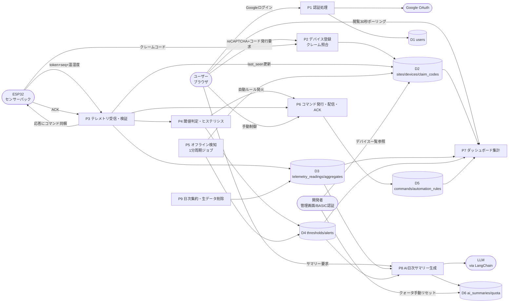

---

## 4. シーケンス図

### 4.1 デバイス登録（クレームフロー）

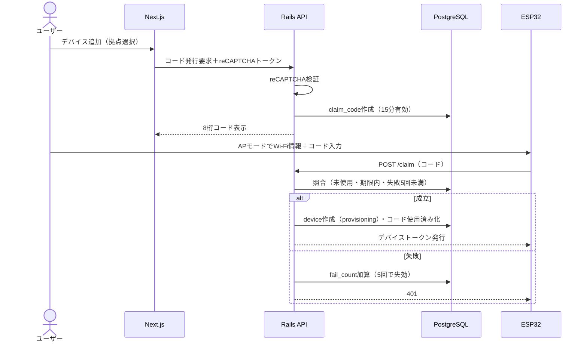

### 4.2 テレメトリ受信〜閾値判定〜コマンドピギーバック

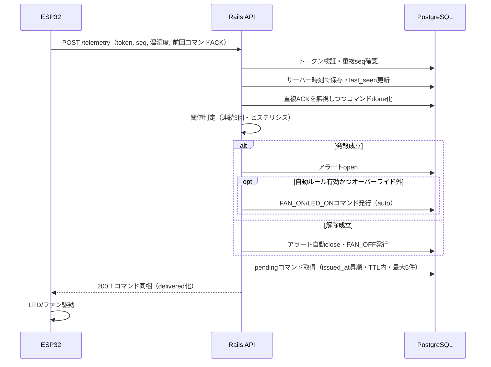

### 4.3 AI日次サマリー（クォータ制御）

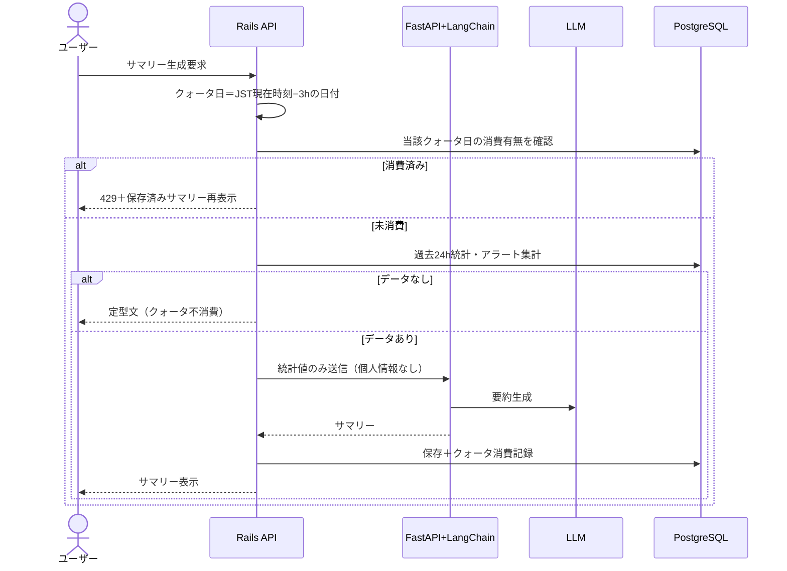

---

## 5. クラス図

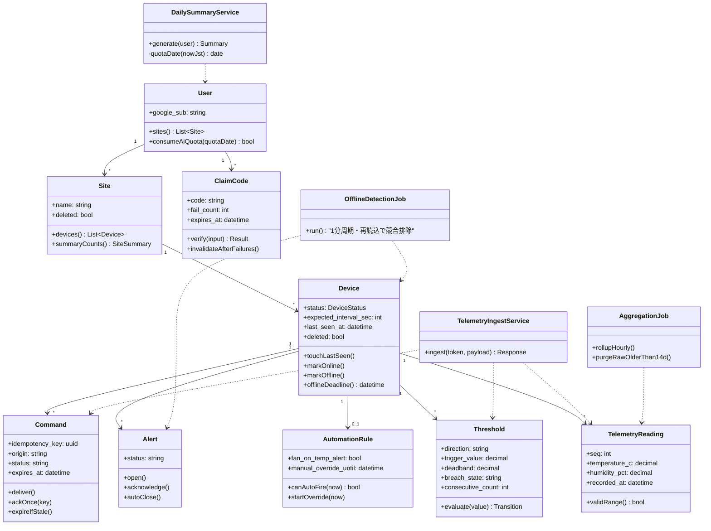

---

## 6. 状態遷移図

### 6.1 デバイス状態

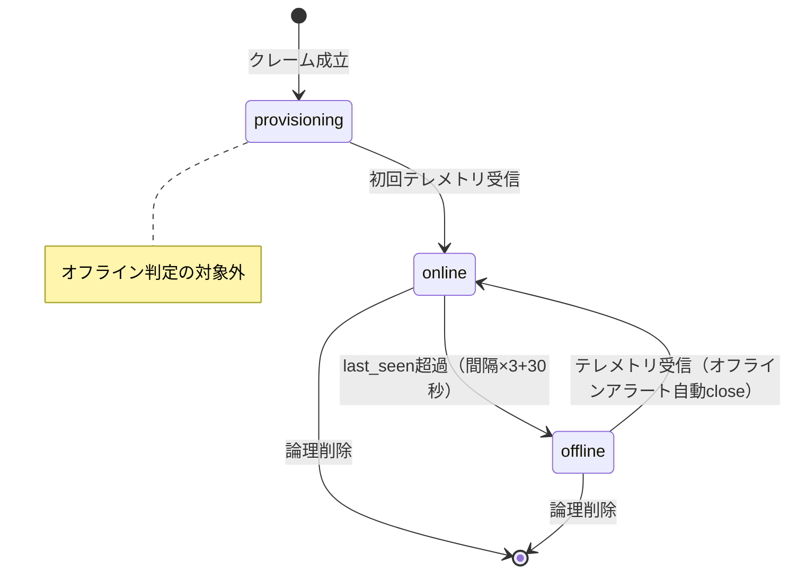

### 6.2 閾値ブリーチ状態（メトリクス×方向ごと）

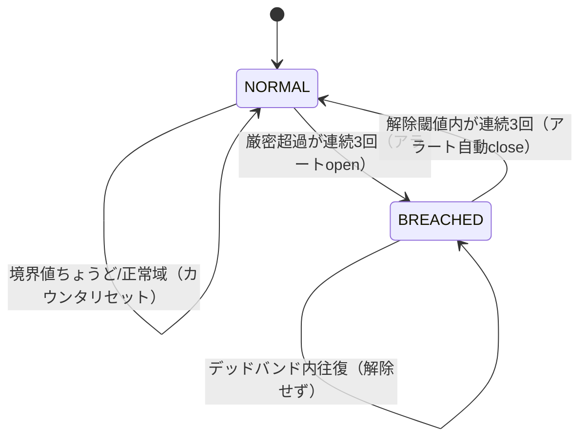

### 6.3 アラート状態

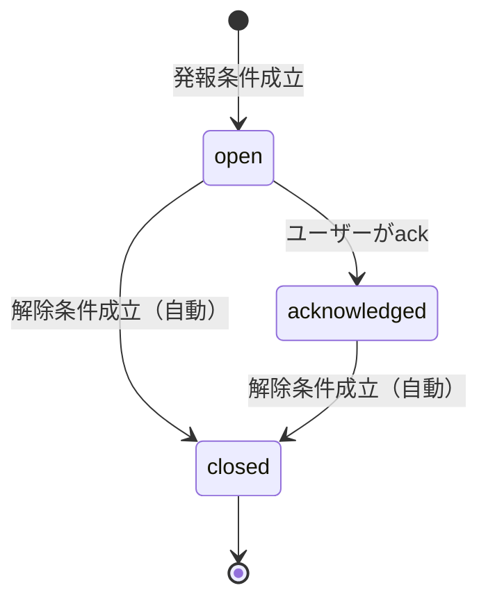

### 6.4 コマンド状態

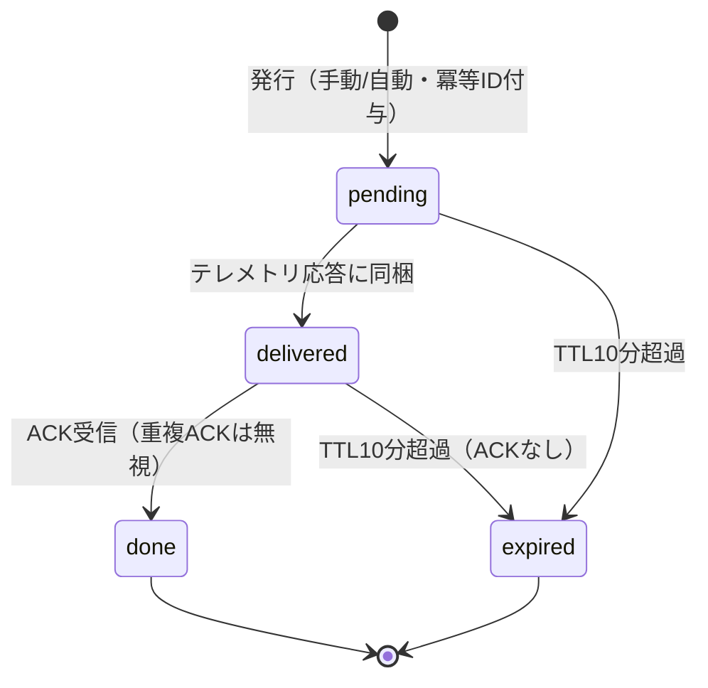

---

## 7. ユースケース図

```mermaid
flowchart TB
    subgraph actors[" "]
        U((ユーザー<br>Googleログイン))
        ESP((ESP32<br>センサーパック))
        DEV((開発者<br>BASIC認証))
        SYS((システム<br>定期ジョブ))
    end
    subgraph system["multisite-sensorpack-mvp"]
        UC1[Googleログインする]
        UC2[拠点を管理する]
        UC3[デバイスを登録する<br>reCAPTCHA必須]
        UC4[複数拠点を一覧監視する]
        UC5[時系列グラフを閲覧する]
        UC6[閾値を設定する]
        UC7[アラートを確認・ackする]
        UC8[LED/ファンを手動制御する]
        UC9[自動制御ルールを設定する]
        UC10[AI日次サマリーを読む<br>1日1回・JST03:00リセット]
        UC11[テレメトリを送信する]
        UC12[コマンドを受領・ACKする]
        UC13[オフラインを検知する]
        UC14[日次集約・生データ削除する]
        UC15[AIクォータを手動リセットする]
        UC16[デバイス一覧を参照する]
    end
    U --- UC1 & UC2 & UC3 & UC4 & UC5 & UC6 & UC7 & UC8 & UC9 & UC10
    ESP --- UC11 & UC12
    ESP --- UC3
    SYS --- UC13 & UC14
    DEV --- UC15 & UC16
```

---

## 8. 補足事項

- **デプロイ：** フロント＝無料Vercel、Rails API・FastAPI・管理画面＝無料Railway（利用不可の場合のみRender）。
- **開発環境DBはSQLite**、本番はPostgreSQL。スキーマは両対応の型のみ使用する。
- **AI利用制限：** 無料プラン扱いとしてアカウントごとに1日1回（JST03:00自動リセット、管理画面から開発者が手動リセット可能）。
- **reCAPTCHA：** クレームコード発行フォームおよびログイン導線に適用（MVP必須要件）。
- **マスタデータ件数（再掲）：MVPエディションは合計17件**（センサー種別2、アクチュエータ種別2、コマンド種別4、アラート種別3、アラート重要度3、デバイス状態3）。
- **テスト制約（再掲）：MVPエディションでは最小単位のデータ（ユーザー2・拠点2・デバイス2・数日分テレメトリ）でしかテストできない。**
